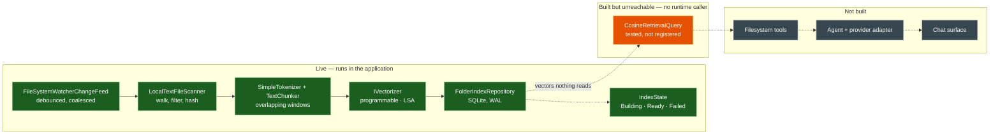

# Implementation status

What is live, what is built but unreachable, and what is not built — as of 2026-09-09.

**Three states, not two.** "Built but unreachable" is the largest category here, and a diagram
with only *done* and *not done* hides it: retrieval is implemented, tested and correct, and it
also never runs. Colouring those the same as either neighbour would misrepresent the system in
opposite directions depending on which you chose.

## The gap, stated plainly

`CosineRetrievalQuery` is not registered in the composition root, and nothing outside
`Retrieval/` and the test suite references `IRetrievalQuery`. Every pass writes vectors that the
running application never reads.

The write half is complete and the query half exists. They are not connected, and the work to
connect them is a runtime caller — which in the plan means the filesystem tools and the agent
that calls them. Until then the vector store is exercised only by tests.

## What each state means here

| State | Meaning |
|---|---|
| **Live** | Constructed by the composition root and reached when the application runs. |
| **Built but unreachable** | Implemented and covered by tests; no code path in a running process reaches it. |
| **Not built** | No implementation. Specified in places, but not written. |

The middle row is the one worth watching. Code in it passes every test it has and contributes
nothing to the product, which is a state that looks like progress in a test summary and is not.
