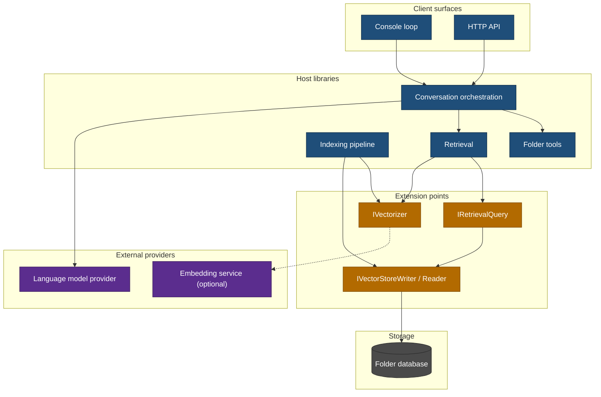

# Library Architecture

Folder Assistant is a modular monolith. Everything runs in one process; the seams that
matter are interfaces, not network boundaries.

This document describes the shape the code is meant to hold as it is built. Where it
describes something not yet written, it says so.

## Design intent

- **One process.** A folder assistant that needs three services running to answer a
  question about a local directory has the wrong shape.
- **Replaceable where replacement is real.** Extension points exist where there is a
  genuine alternative implementation — the embedder, the vector backend, the retrieval
  strategy — not one interface per class.
- **Offline by construction on the default path.** The baseline embedder runs in-process.
  Reaching a network service is something an operator opts into.
- **Storage that survives a model change.** Vectors are keyed by model as well as chunk,
  so introducing a second embedder does not invalidate the first one's work.
- **More than one front end.** A console loop and an HTTP surface over the same pipeline.

## Block colours

- **Blue** — host and runtime, stable.
- **Orange** — replaceable extension points.
- **Grey** — storage.
- **Purple** — external providers.

## Client surfaces

**Console loop** — reads from stdin, writes to stdout. The shortest path to exercising the
whole system, and the one that keeps working when nothing else does.

**HTTP API** — the same pipeline behind a web host, so a UI has something to talk to.

Both go through the same orchestration entry point. A behaviour that exists on only one of
them is a bug, not a feature of that surface.

## Host libraries

**Conversation orchestration** — takes a turn, decides which agent handles it, runs it, and
persists what happened. See [SPEC-100](../specs/SPEC-100-conversation-orchestration.md).

**Folder tools** — the operations an agent can perform against the analyzed folder. Split
into reading and mutating, because the split is what lets an agent be granted one without
the other.

**Indexing pipeline** — scan, tokenize, chunk, embed, store. Each stage is a separate type,
because the chunker's arithmetic and the scanner's filtering are the two places an error is
invisible from outside: a wrongly chunked corpus still indexes and still returns results.

**Retrieval** — embed the query, rank, assemble under a budget.
See [SPEC-110](../specs/SPEC-110-rag-retrieval.md).

## Extension points

These are the interfaces where a second implementation is genuinely expected.

| Interface | Replaces | Why it is a seam |
|---|---|---|
| `IVectorizer` | The embedding implementation | A placeholder, a fitted model and a hosted service are all legitimate, and they differ in dimension and cost |
| `IVectorStoreWriter` / `IVectorStoreReader` | How a vector is stored | The same vectors can sit in a JSON column or a packed binary one; retrieval should not know which |
| `IRetrievalQuery` | How candidates are ranked | A brute-force scan and a native k-NN index answer the same question differently |

An interface that has exactly one implementation and no prospect of a second is not an
extension point; it is indirection.

## Storage

One database per analyzed folder, living inside that folder. Its schema holds the file
manifest, the chunks, the model registry and the vectors.

Two properties are load-bearing:

- **Vectors are keyed `(chunk_id, model_version_id)`.** Several models can coexist, which is
  what makes comparing them against one corpus possible at all.
- **Exactly one model is active for write.** Registering one demotes the others.

See [SPEC-130](../specs/SPEC-130-persistence.md).

## End-to-end flow

**Indexing.** Scan the folder → tokenize → chunk with overlap → embed each chunk → write
files, chunks and vectors in one transaction. The transaction matters: a chunk row whose
vector did not land is a chunk that can never be retrieved, and it looks exactly like a
chunk nothing matches.

**Retrieval.** Embed the query → rank stored vectors of the active model → assemble the
passages that fit the budget → hand them to the agent as context.

## Packaging

One assembly for now. A second one is worth introducing when something outside this process
needs to reference a contract, and not before — a project split made in advance buys
nothing and costs a build graph.

## References

- [System concept](../specs/SPEC-000-system-concept.md)
- [Single-database design and model evolution](single-db-table-design-and-model-evolution.md)
- [Reduction pipeline blueprint](reduction-pipeline-library-implementation-blueprint.md)
- [Superseded microservice design](../archive/diagrams/microservice-architecture.md)
