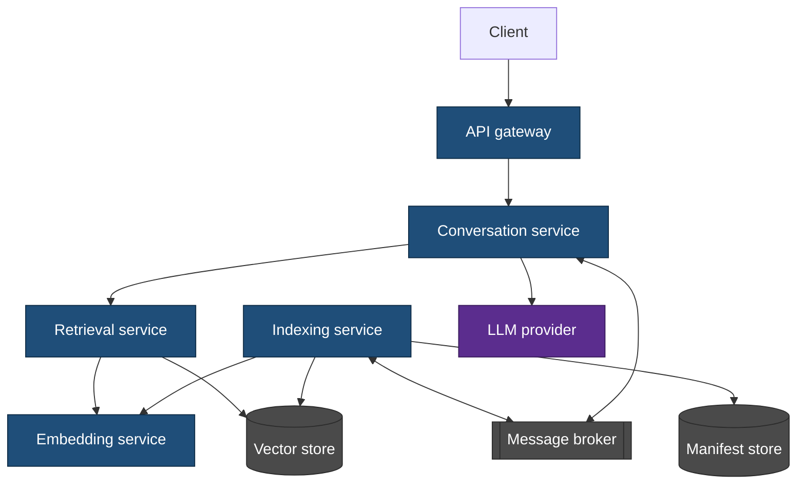

# Microservice Architecture — Superseded

> **This design was not built.** It is kept because the reasoning that rejected it is the
> reasoning behind the shape that was built, and a design record that only contains the
> winning option hides the choice. See [library architecture](../../diagrams/library-architecture.md)
> for what exists.

## What it proposed

Split the system into separately deployable services, each owning one stage of the pipeline
and communicating over HTTP and a message broker.

### The services

- **API gateway** — routing, authentication, rate limiting.
- **Conversation service** — turn handling and history.
- **Indexing service** — folder watching, chunking, delta processing.
- **Embedding service** — the one place a model is loaded, so it is loaded once.
- **Retrieval service** — ranking and context assembly.

### What was attractive about it

- **The embedding model loads once**, in one service, rather than in every process that
  needs a vector. For a large model that is a real saving.
- **Indexing and querying scale separately.** A folder being re-indexed does not compete
  with a user waiting on an answer.
- **A stage can be rewritten in another language** without touching the others.
- **Failure is contained.** A crashing indexer does not take the conversation down.

## Why it was rejected

**The workload does not justify it.** The system indexes one local folder for one user.
Every benefit above is a scaling benefit, and there is no scale here to gain from. The
costs are paid immediately and in full.

**It contradicts the product.** A tool whose value is "point it at a folder and ask
questions" cannot require a broker, a gateway and four services to be running. The
deployment story would be larger than the product.

**Distributed transactions where there were none.** In one process, the manifest, the
chunks and the vectors are written in one transaction. Split across services, that becomes
a saga with compensations — and the failure mode it is protecting against, a chunk whose
vector never landed, is exactly the one that is invisible: the chunk simply never matches
anything.

**Network cost on the hot path.** Retrieval embeds a query and then ranks. As a service
call per step, that is two round trips before ranking starts, on a query a user is waiting
for.

**Service boundaries are not module boundaries.** The seams that mattered turned out to be
the embedder, the vector backend and the ranking strategy — all of which are interfaces,
and none of which is a deployment unit.

## What survived

The decomposition was right; the deployment was wrong. The same stages exist in the built
system as libraries with interfaces between them, and the replaceable ones are replaceable
by composition rather than by redeployment.

**What is genuinely lost:** the embedding model loads in-process, so a large local model is
paid for by this process rather than shared. That is a real cost, accepted knowingly, and
the reason the local-service embedding implementation ([SPEC-162](../../specs/SPEC-162-embedding-ollama-local.md))
exists as an option — it recovers the "load it once" property without any of the rest.

## References

- [Library architecture](../../diagrams/library-architecture.md)
- [SPEC-000 — System concept](../../specs/SPEC-000-system-concept.md)
