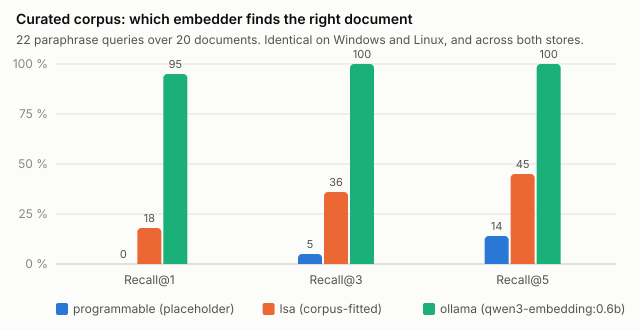
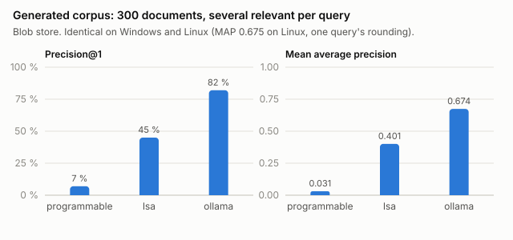
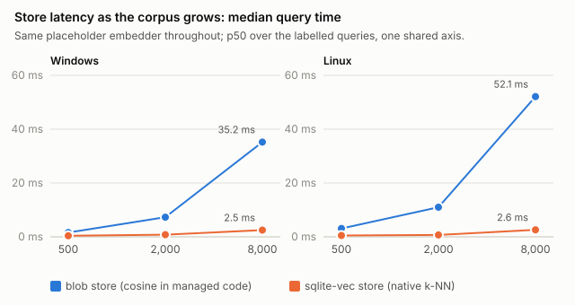
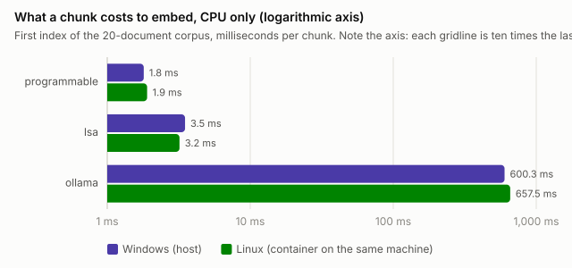

# Every profile, both stores, two operating systems — 2026-09-16

The six composition profiles measured on the tree that makes `ollama-vec` the default, on the
development machine under Windows and again under Linux, with the same corpus, the same queries and
the same instrument. This page is the reading of those measurements; the raw reports the instrument
wrote are beside it — [`semantic-search-results.md`](semantic-search-results.md),
[`semantic-search-full-results.md`](semantic-search-full-results.md),
[`cold-start-indexing.md`](cold-start-indexing.md), [`embed-window.md`](embed-window.md) for Windows,
and the same four under [`linux/`](linux/) — and are the figures of record. Nothing here is carried
forward from an earlier tree.

## What the measurement is for

A profile is two choices bundled: the **embedder** decides whether the right passage is found at all,
and the **store** decides how long finding it takes. The two are measured apart because they answer
different questions — whether the pretrained model earns the server it needs, whether a corpus fit
buys anything, whether the native k-NN store earns its per-platform binary — and a single "best
profile" number would blend an accuracy result and a latency result into something no decision can
use.

The three embedders: `programmable`, a character histogram with no semantics, kept as the floor;
`lsa`, latent semantic analysis fitted to the folder's own text, in-process; `ollama`, the pretrained
`qwen3-embedding:0.6b` served by a local Ollama. The two stores: `blob`, vectors in an ordinary
column ranked by a cosine scan in managed code; `vec`, the native `sqlite-vec` extension's k-NN
index. Every embedder pairs with every store, so six profiles.

## How it was measured

**The instrument** is `SemanticSearchBenchmark`, opt-in behind `RUN_SEMANTIC_BENCHMARK=1`. It runs
each profile over a hand-written corpus of twenty single-topic documents with twenty-two hand-labelled
paraphrase queries, worded to avoid the distinctive vocabulary of the document they should find; then
over three hundred generated documents with several relevant per query, which is the size at which a
corpus-fitted embedder has something to fit; then sweeps the two stores over 500, 2,000 and 8,000
generated documents; then times a cold start and the embed window against the model server. It asserts
nothing and writes its reports under this folder with the operating system, architecture and core
count in the header.

**Windows** is the development laptop: Windows 11 build 26200, an 11th-generation Core i7 with eight
logical processors, 32 GB. Ollama 0.34.1 was installed for this measurement and serves the model on
the CPU; there is no GPU in play.

**Linux** is the same laptop. A Podman machine under WSL2 holds one pod with two containers: the
official Ollama image, serving the same model on the same CPU cores, and the .NET SDK 10 image
(Ubuntu 24.04, SDK 10.0.401) with a copy of this tree. Sharing a pod is what makes `localhost:11434`
the model server inside the SDK container, so no configuration differs from the Windows run. The
[`linux/README.md`](linux/README.md) records the exact steps.

So the comparison is between two operating systems, two kernels and two filesystems on **one
machine**, not between two computers. Where a Linux number is slower, the container's virtual disk is
the first suspect, not the code, and the results below say where that shows.

**One run was discarded.** The first Windows run overlapped the Linux container's embedding on the
same eight cores; its accuracy columns matched the clean run to the digit, its timings did not, and
it was thrown away. The Windows figures here are from a rerun with the container stopped.

## Accuracy: identical across operating systems, and across stores

The accuracy columns are properties of the model and the corpus. They came out the same on Windows
and on Linux, and the same for a `-blob` profile and its `-vec` twin — which is the check that the
two stores rank identically over the same vectors rather than an assumption that they do.



| Embedder | Recall@1 | Recall@3 | Recall@5 | MRR@10 |
|---|---:|---:|---:|---:|
| `programmable` | 0 % | 5 % | 14 % | 0.105 |
| `lsa` | 18 % | 36 % | 45 % | 0.334 |
| `ollama` | 95 % | 100 % | 100 % | 0.977 |

The placeholder puts the right document first for none of the twenty-two queries — guessing among
twenty would manage about one — and that is the intended result: the queries were written to deny a
character histogram the shared vocabulary it can accidentally reward. The corpus-fitted embedder
finds a fifth at rank one and nearly half within five, from twenty documents that give a fit almost
nothing to generalise from. The pretrained model finds twenty-one of twenty-two at rank one and every
one within three.



| Embedder | P@1 | MAP (Windows) | MAP (Linux) | nDCG@10 | Recall@10 |
|---|---:|---:|---:|---:|---:|
| `programmable` | 7 % | 0.031 | 0.031 | 0.071 | 7 % |
| `lsa` | 45 % | 0.401 | 0.401 | 0.451 | 44 % |
| `ollama` | 82 % | 0.674 | 0.675 | 0.747 / 0.748 | 71 % / 72 % |

On the larger corpus the fitted embedder is thirteen times the placeholder's mean average precision
and a little over half the pretrained model's. That is what `SPEC-161` claims for it — real, and
weak — and it is why `lsa-vec` is the profile to name where nothing can be installed, not the
default. The Linux MAP differs in the third decimal from one query's rounding; the ranking is the
same.

## The stores: the native index wins once the corpus is big enough to matter



| Docs | Store | Windows p50 | Windows p95 | Linux p50 | Linux p95 |
|---:|---|---:|---:|---:|---:|
| 500 | `blob` | 1.6 ms | 2.3 ms | 3.1 ms | 5.7 ms |
| 500 | `vec` | 0.4 ms | 0.7 ms | 0.5 ms | 0.7 ms |
| 2,000 | `blob` | 7.3 ms | 10.9 ms | 11.0 ms | 15.6 ms |
| 2,000 | `vec` | 0.8 ms | 0.9 ms | 0.7 ms | 1.1 ms |
| 8,000 | `blob` | 35.2 ms | 48.8 ms | 52.1 ms | 60.7 ms |
| 8,000 | `vec` | 2.5 ms | 2.8 ms | 2.6 ms | 3.0 ms |

The shape `SPEC-131` recorded on 2026-09-15 holds on both operating systems: the blob scan grows
with the corpus, the native index does not, and by eight thousand documents the gap is fourteen times
on Windows and twenty on Linux. The native store's figures are the same on both systems to a tenth of
a millisecond, because a k-NN read touches little disk; the blob scan is the one that reads every
vector, and on the container's virtual disk that costs half again as much — the filesystem, not the
code.

Below a few hundred documents the two are within a couple of milliseconds of each other, and at
twenty documents the blob store is the faster one (0.1 to 0.2 ms against 0.4 to 1.0 ms in the
curated-corpus tables), because a native index has fixed costs and nothing to amortise them against.
The folder a person works in usually sits in that range; the index earns its binary on the folders
that do not.

Index time is the other side of the store: at eight thousand documents the native store writes in
3.0 s on Windows and 3.3 s on Linux against 2.6 s for the blob store on both. The extra is the
index being built, and it is paid once.

## What the pretrained model costs



| Embedder | Windows, per chunk | Linux, per chunk | First index, 20 documents |
|---|---:|---:|---:|
| `programmable` | 1.8 ms | 1.9 ms | 36 ms / 37 ms |
| `lsa` | 3.5 ms | 3.2 ms | 69 ms / 65 ms |
| `ollama` | 600 ms | 658 ms | 12.0 s / 13.2 s |

This is the price of the default, CPU only, and it is not small: every chunk costs about six hundred
milliseconds, two hundred times the fitted embedder, and a first index of a real folder is almost
entirely this. Nothing else in the pipeline is worth optimising until that stops being true — the
embed window measurement says so directly: gathering sixty-four chunks into one call instead of
one call per chunk changes the first index by 3 % on Windows (11.98 s to 11.65 s) and by an amount
inside the spread of the passes on Linux (14.6 s, 12.6 s, 13.9 s at windows 1, 8, 64). What is paid
for is the model's inference, not the round trip.

Query latency follows the same rule. A curated-corpus query takes about 175 ms on Windows and 180 ms
on Linux with the pretrained model — almost all of it embedding the query — and under a millisecond
with either in-process embedder:

| Profile | Windows, mean query | Linux, mean query | Windows, index | Linux, index |
|---|---:|---:|---:|---:|
| `programmable-blob` | 0.2 ms | 0.2 ms | 47 ms | 20 ms |
| `programmable-vec` | 0.7 ms | 0.5 ms | 52 ms | 21 ms |
| `lsa-blob` | 0.1 ms | 0.2 ms | 123 ms | 179 ms |
| `lsa-vec` | 0.5 ms | 0.4 ms | 72 ms | 57 ms |
| `ollama-blob` | 173.9 ms | 180.4 ms | 13.2 s | 13.6 s |
| `ollama-vec` | 175.0 ms | 178.2 ms | 12.0 s | 13.4 s |

## What changed since the last record, and what did not

- **One curated query fewer.** On 2026-09-12 the pretrained model put the right document first for
  all twenty-two queries; today it does for twenty-one, on both operating systems. The corpus and the
  queries have not changed since that commit, so the difference is in the model build or the server
  that serves it, not in this tree. Which query moved has not been investigated; the finding is
  recorded, not explained.
- **The per-chunk cost is higher than the 386 ms recorded then**, because that was a different
  machine. The ratio to the in-process embedders is the thing to carry, not the milliseconds.
- **Everything else reproduced**: the placeholder's and the fitted embedder's accuracy figures to the
  last digit, the store agreement, and the shape of the backend sweep.

## Reading these numbers

- Accuracy figures are the ones to act on. They belong to the model and the corpus, they came out
  identical across two operating systems and two stores, and they are the basis for `ollama-vec`
  being the default and `lsa-vec` the named alternative.
- Timing figures belong to this machine on this day. They are given so that the ratios between
  profiles can be read, and so that the next measurement has a previous one to compare with on
  the same hardware. They are not a claim about any other machine, and a machine with a GPU would
  show a different pretrained-model column entirely.
- The Linux column is a container on the same laptop. It answers "does the code behave the same
  under Linux" — it does — and not "how fast is a Linux server".

## Reproducing it

On either operating system, with Ollama running and `ollama pull qwen3-embedding:0.6b` done:

```bash
RUN_SEMANTIC_BENCHMARK=1 dotnet test --filter "FullyQualifiedName~SemanticSearchBenchmark" -l "console;verbosity=detailed"
```

The four reports are rewritten in this folder with the measuring system in their header. Without
Ollama the `ollama-*` rows are simply absent, never faked. The charts on this page are drawn from the
tables by hand and are not regenerated by the instrument; a re-measurement replaces them.
