# Implementation status

The whole structure the plan converges on, every block coloured by what is true of it now — as of
2026-09-24. Updated with every commit that moves a block; at the end, every block is green.

**Five states, not two.** *Built but unreachable* is the category a diagram with only *done* and
*not done* hides: for most of Phase B, retrieval was implemented twice over, tested, composed — and
never ran. It emptied on 2026-09-24, when the console gave every built block its caller, and it is
kept because the next block built ahead of its caller lands in it. *Live with a defect queued* is
the other one worth its own colour: a block that runs in the application and has a numbered item
against it in the plan's §5.1, so the green it will earn is not the green it has.

```mermaid
flowchart TB
    subgraph composition["Composition — Program.cs"]
        direction LR
        root["Composition root<br/>lazy IOptions, startup filter"]
        profiles["CompositionProfiles<br/>6 named bundles; ollama-vec default, loud store fallback to ollama-blob"]
        config["AgentConfig<br/>section FolderAssistant"]
        metrics["GET /metrics<br/>Prometheus exporter"]
    end

    subgraph embedding["Embedding — SPEC-160/161/162"]
        direction LR
        prog["ProgrammableEmbeddingVectorizer<br/>character histogram"]
        lsa["LsaEmbeddingVectorizer<br/>corpus-fitted"]
        ollama["OllamaEmbeddingVectorizer<br/>qwen3-embedding, local, bounded calls"]
        etel["EmbeddingTelemetryVectorizer<br/>Wrap, probe re-exposed"]
    end

    subgraph indexing["Indexing — SPEC-120/121"]
        direction LR
        pass["Whole-folder pass<br/>record, fit, embed, mark delivered"]
        state["IndexState<br/>Building · Ready · Failed, retried"]
        indexer["FolderIndexer<br/>watcher · reconciler · change pipeline · dispatcher"]
        store["FolderIndexStore<br/>one writer of file_manifest + outbox"]
        bridge["RagBridgeVectorizationService<br/>chunks + vectors under the delivered id; unfitted fails"]
        hold["BeginBatch hold<br/>nests, expires"]
    end

    subgraph persistence["Persistence — SPEC-130"]
        direction LR
        boot["FolderDatabaseBootstrapper<br/>manifest.db, WAL, migrations"]
        conn["FolderDatabaseConnection<br/>foreign_keys, busy_timeout, no shared cache, no pool"]
        blob["Blob vector store<br/>chunk_vector"]
        vec["sqlite-vec store<br/>vec0 per model"]
        convdb["conversations.db<br/>bootstrapper, ConversationStore"]
    end

    subgraph retrieval["Retrieval — SPEC-110"]
        direction LR
        cosine["CosineRetrievalQuery"]
        vecq["SqliteVecRetrievalQuery"]
        floor["RelevanceFloor<br/>low-confidence screen"]
        reducer["TokenBudgetContextReducer<br/>hybrid rerank, MMR, score gap"]
        rtel["RetrievalTelemetryQuery<br/>log line + meter"]
        snippet["PassageBuilder<br/>verified against chunk_hash before anything sees it; stale yields no text"]
    end

    subgraph tools["Tools — Phase A, SPEC-101"]
        direction LR
        guard["WorkspacePathGuard<br/>containment, links, hard links, subst, metadata folder"]
        readt["Read tools<br/>InspectDirectory · ReadFile · Retrieve · FindFiles"]
        textsearch["SearchText<br/>index-independent, bounded four ways"]
        about["FindFilesAbout<br/>file-level semantic, same seams"]
        mutate["Mutation tools<br/>Create · Update · ReplaceLines · Delete"]
        extract["Text extraction registry<br/>one source of the extension list; plain text; docx/pdf now registrable"]
    end

    subgraph agent["Agent and orchestration — Phase B, SPEC-100/140"]
        direction LR
        provider["Provider + agent factory<br/>OpenAI-compatible, Azure; NetworkTimeout set; failures as one sentence"]
        facade["Tool facades<br/>file tools non-fatal · search tools fatal"]
        roster["Roster · catalog · registry · routing<br/>default roster in code; cycles refused at startup"]
        runner["WorkflowRunner / IAgentExecution<br/>turn telemetry inside the execution; sessions in memory"]
        searchidx["SearchIndex tool<br/>over-fetch, verify, screen, cut, reduce; memoized per turn"]
        batching["BatchHoldingAgent<br/>one hold per agent run, nested for delegates; never at a transport"]
        console["Console loop<br/>beside the host; exit stops both; redirected or closed stdin does not"]
    end

    subgraph surface["Conversation and HTTP — Phase C, SPEC-170 to write"]
        direction LR
        turns["TurnRecordingAgent<br/>message capture over the roster"]
        history["GET/DELETE /api/history"]
        status["GET /api/index/status<br/>read-only, bounded failed sample"]
        responses["OpenAI Responses endpoints + DevUI<br/>SQLite conversation storage, loopback only"]
        provenance["Provenance framing<br/>file content is data, not instructions"]
    end

    subgraph deferred["Deferred, deliberately"]
        direction LR
        webui["Custom web UI"]
        approvals["Human-in-the-loop approvals<br/>IApprovalGate"]
        legacydoc[".doc extraction"]
        hybrid["Hybrid lexical recall<br/>FTS5 union"]
    end

    root --> profiles --> etel
    etel -.-> prog & lsa & ollama
    root --> pass --> indexer
    indexer --> store --> bridge
    pass -.-> state
    bridge --> blob & vec
    blob & vec -.->|"vectors nothing reads"| cosine & vecq
    cosine & vecq --> floor --> reducer --> rtel -.-> metrics
    rtel --> searchidx
    snippet --> searchidx
    guard --> readt & textsearch & mutate & about
    readt & textsearch & about & searchidx & mutate --> facade --> roster --> runner
    provider --> roster
    runner --> batching --> hold
    runner --> console & turns & responses
    turns --> convdb
    history & status --> convdb
    provenance -.-> facade

    classDef live fill:#1b5e20,stroke:#a5d6a7,color:#ffffff
    classDef defect fill:#8d6e00,stroke:#ffe082,color:#ffffff
    classDef built fill:#e65100,stroke:#ffcc80,color:#ffffff
    classDef planned fill:#37474f,stroke:#b0bec5,color:#ffffff
    classDef deferredCls fill:#263238,stroke:#546e7a,color:#b0bec5,stroke-dasharray:4 3

    class root,config,metrics,profiles,prog,lsa,ollama,etel,pass,state,indexer,store,bridge,hold,boot,conn,blob,vec,rtel,extract live
    class cosine,vecq,floor,reducer,snippet,guard,readt,textsearch,about,searchidx,mutate,provider,facade,roster,runner,batching,console live
    class convdb,turns,history,status,responses,provenance planned
    class webui,approvals,legacydoc,hybrid deferredCls
```

## Legend

| Colour | State | Meaning |
|---|---|---|
| green | **Live** | Constructed by the composition root and reached when the application runs. |
| amber | **Live, defect queued** | Runs, and has a numbered item against it in the plan's §5.1 that is not yet landed. |
| orange | **Built but unreachable** | Implemented and covered by tests; no code path in a running process reaches it. Empty since 2026-09-24. |
| grey | **Planned** | No implementation. Its phase and spec are named in the block's subgraph. |
| dashed | **Deferred** | Consciously out of scope until the first push is green; listed so the omission is visible. |

Solid arrows are calls that exist. Dotted arrows are seams that exist on one side only, or
composition without a caller.

## Phase 0 ledger — fix the core before building on it

| Item | Block | State |
|---|---|---|
| §5.1 **2 + 5** — one writer of `file_manifest`; the pass records through the front end's comparison, embeds what lacks vectors, marks delivered, deletes nothing | `store`, `pass`, `bridge` | **Landed** 2026-09-14 (`bf9fc4f`) |
| §5.1 **3** — an embed call has a deadline, surfaced as a timeout rather than a cancellation; telemetry tells the caller's cancellation from a deadline | `ollama`, `etel`, `rtel` | **Landed** 2026-09-14 |
| §10 — the embedding client retries nothing underneath a call and carries the configured deadline as its own network timeout: the probe and the dispatcher are the retry layers, and a server that is not there costs a probe attempt one connection rather than four and the whole deadline; SPEC-162 0.9.0 | `ollama` | **Landed** 2026-09-24 |
| §5.1 **4** — a corpus-fitted profile with no fit fails a delivery rather than marking it synced | `bridge` | **Landed** 2026-09-14 |
| §5.1 **6** — the bridge's gate wraps the write, not the embed | `bridge` | **Landed** 2026-09-14 |
| §10 — a removal queued before the file came back is retired without ending the row it has since taken again | `indexer` | **Landed** 2026-09-15 |
| §10 — connection pooling off on every connection: the pool shared one handle between threads about once in 1,500 concurrent opens, measured with no pool clearing in the process; an open without it costs about 0.35 ms; the retry around `BEGIN` rejected as hiding the fault; SPEC-130 0.14.0 | `conn` | **Landed** 2026-09-16 |
| §5.1 **1** — the default profile retrieves better than chance: `lsa-vec`, with a loud, default-only fallback to `lsa-blob` where the native store has no binary; benchmark re-run on this tree for every profile this machine can measure; SPEC-000 0.3.0, SPEC-131 0.8.0, SPEC-161 0.5.0, SPEC-162 0.7.0 | `profiles` | **Landed** 2026-09-15 |
| Default moved to `ollama-vec` by the owner's decision, with `ollama-blob` as the store-only fallback; an unreachable Ollama fails the index loudly and never substitutes an embedder; every profile re-measured on this tree on Windows and Linux (`docs/benchmarks/`, `docs/benchmarks/linux/`); SPEC-000 0.4.0, SPEC-131 0.9.0, SPEC-161 0.6.0, SPEC-162 0.8.0 | `profiles` | **Landed** 2026-09-16 |
| §5.1 **7** — SPEC-000 stops claiming an agent and a closed network | spec only | Queued, Phase D |
| §5.2 **1** — a rebuilt passage is verified against `chunk_hash` before anything sees it: `ChunkHash` carried on the hit, `PassageBuilder` re-reading the file through the extraction registry, tokenizing and joining as the chunker does, hashing with the chunker's own method; a mismatch or a shrunken file yields a stale passage with no text, a missing file or a format without an extractor an unavailable one; composed in the root, called by nothing until B6; `.docx`/`.pdf` extractors now registrable; SPEC-110 0.12.0, SPEC-120 0.19.0 | `snippet` | **Landed** 2026-09-23 |

## Phase A ledger — containment and tools

| Item | Block | State |
|---|---|---|
| **A1** — every caller-supplied path resolves through one containment guard: outside the root, a link or junction at any segment, a hard link named outside the root, a `subst` letter for a path that is, and the metadata folder are refused; SPEC-101 written with it | `guard` | **Landed** 2026-09-15 |
| **A2** — read tools: listing, numbered line range, bounded whole file, glob over a self-walked list; bounds as constants, a note for every cut, an exception for every hard failure; SPEC-101 0.2.0 | `readt` | **Landed** 2026-09-15 |
| **A3** — `SearchText`: a literal or regex line scan over the scanner's own extensions and size bound, on the same walk as `FindFiles`; whole-word through one shared rule; bounded by matching lines, matched characters, a deadline and the caller's token, each said in the note; SPEC-101 0.3.0 | `textsearch` | **Landed** 2026-09-15 |
| **A4** — `FindFilesAbout` in its own search holder over the composed, wrapped retrieval query: over-fetched passages folded into files scored by their best passage, bounded and said, refusal passing through; SPEC-101 0.4.0 | `about` | **Landed** 2026-09-16 |
| **A5** — mutation tools in their own holder over a second guard: `Create`, `Update`, `ReplaceLines`, `Delete`; every write a temporary file and a retried rename, every delete retried, reads not; each completed mutation reported to the running front end with its own kind, advisory; SPEC-101 0.5.0 | `mutate` | **Landed** 2026-09-16 |
| **A6** — text extraction registry: `ITextExtractor`, a plain-text extractor, `TextExtractorRegistry` as the one source of the extension list and of each format's decoding, asked by the scanner, the bridge, the watcher's filter and the text search, which reads only formats that scan as raw lines; `.docx`/`.pdf` wait on snippet verification; SPEC-120 0.18.0, SPEC-101 0.6.0. Live: the running pass reads through it | `extract` | **Landed** 2026-09-16 |

## Phase B ledger — the agent and orchestration

| Item | Block | State |
|---|---|---|
| **B1** — provider and agent factory: one client family in two shapes (OpenAI-compatible, Azure), built not connected, refused at construction with a sentence when the configuration names no provider, `NetworkTimeout` set to the configured connection timeout, sampling defaults through the builder; `AgentFactory` and `AgentHandle` owning agent and client together; registered in the root, resolved by nothing; SPEC-140 0.2.0, SPEC-100 0.3.0 | `provider` | **Landed** 2026-09-16 |
| **B2** — tool reflection and the facades: every described public method of the three holders reflected into a function named after it; each wrapped in one facade that times the call, logs one structured line and applies its group's contract — a file tool's failure a `TOOL_FAILED:` string the prompt tells the model to report, a search tool's failure the exception itself, ending the turn through a loop built to tolerate none; the group decided by the holder's type in one place; the agent built with all ten and a duplicate name refused; SPEC-100 0.4.0, SPEC-101 0.7.0 | `facade` | **Landed** 2026-09-16 |
| **B3** — roster, catalog, registry, routing: three rosters by precedence (the operator's whole, the default from code behind `Workflow:UseDefaultRoster`, one agent from the root holding every tool), validated whole at startup through the startup filter — repeated name, unknown tool or delegate, self-delegation, cycle, missing or unnamed coordinator all refused before the host listens; the catalog narrowing every tool by name; one handle per entry over its own client with one delegation tool per target under the fatal contract; the static route to the coordinator; provider inherited per field, the role never; the default roster off until measured; SPEC-100 0.5.0 | `roster` | **Landed** 2026-09-18 |
| **B4** — the turn: `IAgentExecution` loads the coordinator's session for the conversation, runs the agent and saves the session only when the turn succeeded, keyed by agent and conversation, held in memory until the conversation database exists; a session that cannot be read starts a fresh one; the turn's telemetry recorded inside the execution — a failed streamed turn drains as text, so a wrapper would record success — classified by the caller's token first, an abandoned stream cancelled, latency stopped before the save, a second meter at `GET /metrics`; `WorkflowRunner` as the `IChatClient` a front end talks to, naming the conversation on every response; registered in the root, resolved by nothing; SPEC-100 0.6.0 | `runner` | **Landed** 2026-09-21 |
| **B5** — readable provider errors: one describer turning a provider's failure into a sentence naming the key to look at or the time to try again — the credentials, the deployment, the endpoint, the timeout; `Retry-After` as an HTTP date whichever form it came in; the inner chain walked; null for what is not the provider's; the turn's streamed failure note uses it; SPEC-140 0.3.0, SPEC-100 0.6.1 | `provider` | **Landed** 2026-09-23 |
| **B6** — `SearchIndex`, the passage search: over-fetch by a multiplier to a cap, every hit rebuilt and verified through the passage builder with stale and unavailable passages withheld and said, the low-confidence screen on the best verified match (off by default), the relative score-gap cutoff against the query's own best, the reducer under a constant budget, every stage's count in the note; memoized per `(query, maxResults)` for one turn through an `AsyncLocal` scope the execution opens unconditionally; the default reader holds it; SPEC-101 0.8.0, SPEC-100 0.6.2, SPEC-110 status | `searchidx` | **Landed** 2026-09-23 |
| **B7** — the batch hold at the agent-run boundary: `BatchHoldingAgent` over every agent the registry builds, `BeginBatch` opened before a run and released when it returns, throws, or its enumeration is disposed; a delegate's run nested in its caller's; never at a transport; SPEC-121's waiting caller; SPEC-100 0.6.3, SPEC-121 0.20.1 | `batching` | **Landed** 2026-09-23 |
| **B8** — the console, the first front end: a hosted service beside the web host reading standard input a line at a time, each line one turn through the runner, streamed back; one conversation per process; `exit` stops the host with it; a redirected standard input does not start the loop and a closed one does not stop the host; the runner resolved on the first question so a keyless host boots and says the missing setting at the prompt; the streams registered as the seam a host test types through. **Every block built ahead of its caller in Phase A and B is live with it.** SPEC-100 0.7.0 | `console`, and every orange block | **Landed** 2026-09-24 |

## The gap, stated plainly

The indexing side is whole and live: a whole-folder pass at start, then the file-indexing front end
keeping the index in step with the folder — every changed file settled, recorded, queued, delivered,
chunked, embedded and stored, with a periodic comparison healing whatever the watcher missed.
`file_manifest` has one writer of what a row says, and a chunk row's foreign key is what holds it.

Since 2026-09-24 the question side is live too, end to end: the console reads a question, the runner
runs the turn through the roster's coordinator, the agent calls the tools through their facades, and
the passage search runs retrieval, the passage builder, the screen and the reducer. Every vector the
pipeline writes is one a question can read, and the orange colour that held most of Phase B is empty.

What remains is grey, and it is Phase C: the HTTP surface and DevUI, the conversation database that
lets a conversation outlive the process, the history and status endpoints, and the provenance framing
on file content reaching a model that holds mutation tools. Beside them stand two measurements the
plan names before any default moves — the roster's cost against the single agent, and the score-gap
fraction from the benchmark — and the tuning they decide.
