# Implementation status

What is live, what is built but unreachable, and what is not built — as of 2026-09-12.

**Three states, not two.** "Built but unreachable" is the category a diagram with only *done* and
*not done* hides: retrieval is implemented twice over, tested, composed — and it still never runs.
Colouring those the same as either neighbour would misrepresent the system in opposite directions
depending on which you chose.

```mermaid
flowchart LR
    subgraph live["Live — runs in the application"]
        direction TB
        pass["Whole-folder pass<br/>scan, chunk, embed, store — once, at start"]
        watch["FileSystemWatcherHost<br/>debounced, coalesced, holds"]
        reconcile["Reconciler<br/>periodic safety net"]
        pipeline["ChangePipeline<br/>settle, hash, record"]
        outbox["FolderIndexStore<br/>records + durable outbox"]
        dispatch["OutboxDispatcher<br/>at-least-once delivery"]
        bridge["RagBridgeVectorizationService<br/>chunk, embed, store one file"]
        state["IndexState<br/>Building · Ready · Failed"]
    end

    subgraph built["Built but unreachable — no runtime caller"]
        direction TB
        query["IRetrievalQuery x2<br/>composed, never called"]
        reducer["TokenBudgetContextReducer<br/>composed, never called"]
    end

    subgraph notbuilt["Not built"]
        direction TB
        tools["Filesystem tools"]
        agent["Agent + provider adapter"]
        chatui["Chat surface"]
    end

    pass --> watch
    watch --> pipeline --> outbox --> dispatch --> bridge
    reconcile --> outbox
    pass -.-> state
    bridge -.->|"vectors nothing reads"| query
    query -.-> tools -.-> agent -.-> chatui

    classDef liveCls fill:#1b5e20,stroke:#a5d6a7,color:#ffffff
    classDef builtCls fill:#e65100,stroke:#ffcc80,color:#ffffff
    classDef gapCls fill:#37474f,stroke:#b0bec5,color:#ffffff

    class pass,watch,reconcile,pipeline,outbox,dispatch,bridge,state liveCls
    class query,reducer builtCls
    class tools,agent,chatui gapCls
```

## The gap, stated plainly

The indexing side is now whole and live: a whole-folder pass at start, then the file-indexing front
end keeping the index in step with the folder — every changed file settled, recorded, queued,
delivered, chunked, embedded and stored, with a periodic comparison healing whatever the watcher
missed. Nothing in the test suite or the running application calls a stage by hand any more.

`IRetrievalQuery` **is** registered in the composition root — the active composition profile
resolves one of two implementations, and either can be pulled out of the container — and the
context-assembly stage (`TokenBudgetContextReducer`) sits beside it in the same position: built,
tested, composed, and with nothing calling it. What is still missing is a caller: nothing on the
request path asks either of them anything, so every vector the pipeline writes is one the running
application never reads.

That narrows the gap to one edge. The remaining work is a runtime caller, which in the plan means
the filesystem tools and the agent that calls them. Until that lands, both vector backends, the
whole indexing subsystem and all the measured performance work are infrastructure with no consumer.

## What each state means here

| State | Meaning |
|---|---|
| **Live** | Constructed by the composition root and reached when the application runs. |
| **Built but unreachable** | Implemented and covered by tests; no code path in a running process reaches it. |
| **Not built** | No implementation. Specified in places, but not written. |

The middle row is the one worth watching. Code in it passes every test it has and contributes
nothing to the product, which is a state that looks like progress in a test summary and is not.
